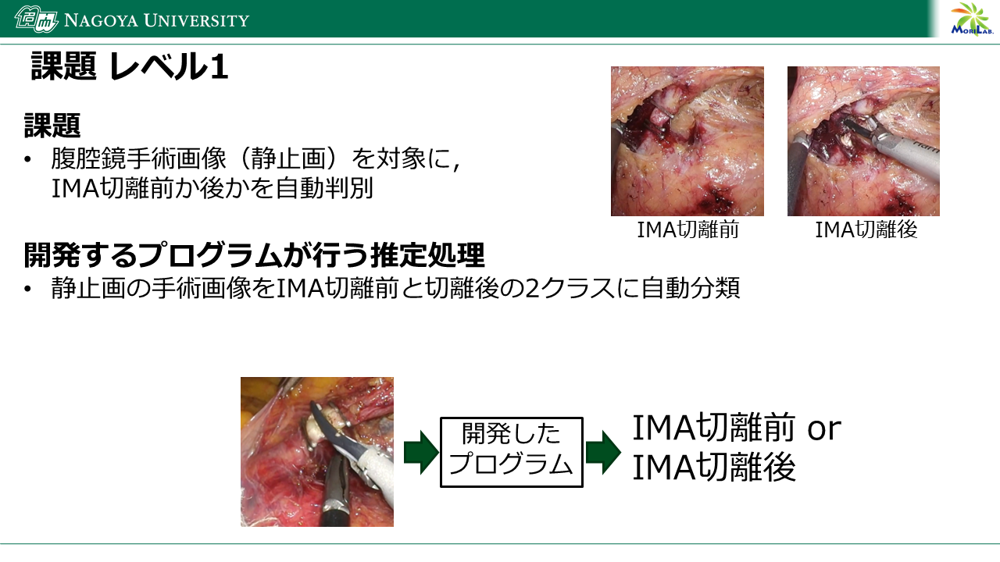
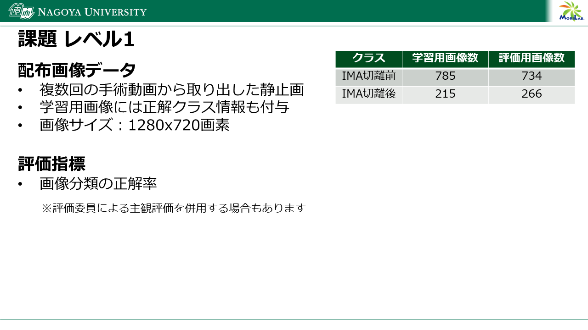

# 課題レベル1

## 課題
腹腔鏡手術画像（静止画）を対象に，IMA切離前か後かを自動判別

## 開発するプログラムが行う推定処理
静止画の手術画像をIMA切離前と切離後の2クラスに自動分類


## 配布画像データ
複数回の手術動画から取り出した静止画

## 評価指標
画像分類の正解率

※評価委員による主観評価を併用する場合もあります


## 提出物
評価用画像（締切が近づいたら公開予定）に対して，開発したプログラムが出力した自動推定結果を提出していただきます．

- 評価用画像から算出した分類結果csvファイル submission.csv
   - File列に画像ファイル名，画像ファイルに対応する推定ラベル値をCategory列に記入したcsvファイルを作成してください．ラベル値は以下を使用してください．
      - IMA切離前: 0
      - IMA切離後: 1
   - submission.csvファイルは以下のフォーマットとしてください．

```
File,Category   
9997.jpg,0
9998.jpg,1
9999.jpg,1
```

   - sample_submission.csv の1行目（列ラベル）及び1列目（File列）は変更しないでください．
   - sample_submission.csv のFile列の並び順は変更しないでください．

- 手法の概要原稿
   - 使用した手法を説明した原稿をメールで提出してください．原稿フォーマットは日本コンピュータ外科学会大会のものを使用してください．ページ数は1ページまたはそれ以上でも可です．

メールに代表者の連絡先情報（お名前，ご所属，連絡先メールアドレス，電話番号，第33回日本コンピュータ外科学会大会（2024年11月8日～10日開催）への参加可否（代理可），その他連絡事項）をご記載いただき，上記提出物と共に以下にメールで提出してください．

提出先メールアドレス：
jscas-aichallenge@mori.m.is.nagoya-u.ac.jp
