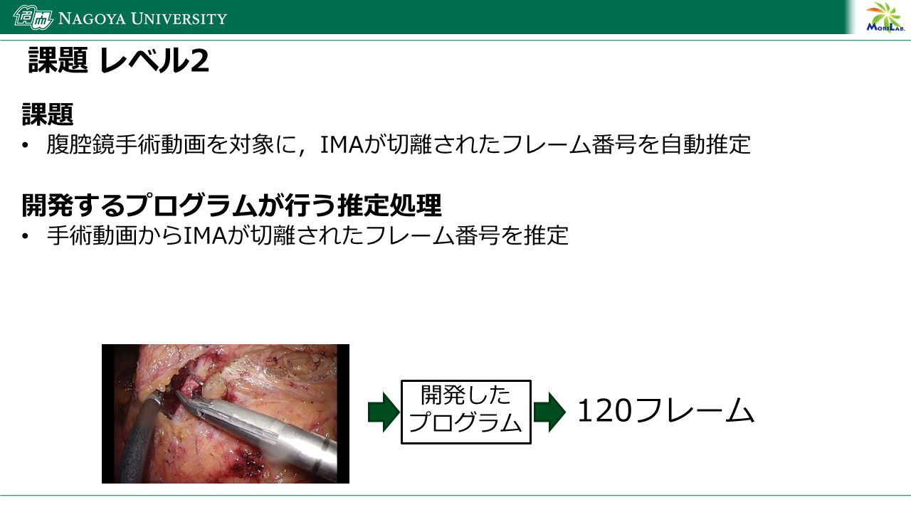
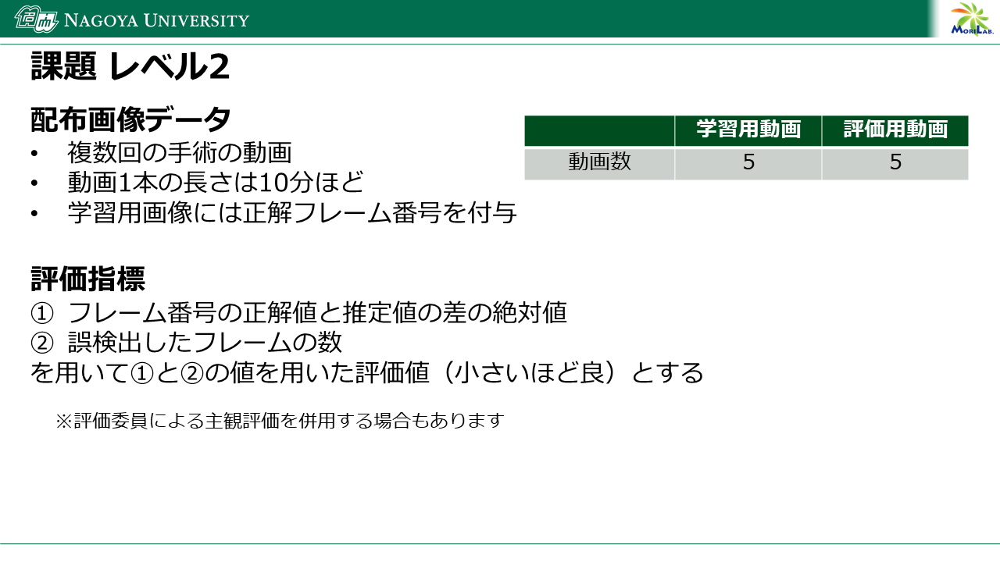

# 課題レベル2

## 課題
腹腔鏡手術動画を対象に，IMAが切離されたフレーム番号を自動推定

## 開発するプログラムが行う推定処理
手術動画からIMAが切離されたフレーム番号を推定

## 配布画像データ
複数回の手術の動画

## 評価指標
1. フレーム番号の正解値と推定値の差の絶対値
2. 誤検出したフレームの数

を用いて1.と2.の値を用いた評価値（小さいほど良）とする

※評価委員による主観評価を併用する場合もあります

